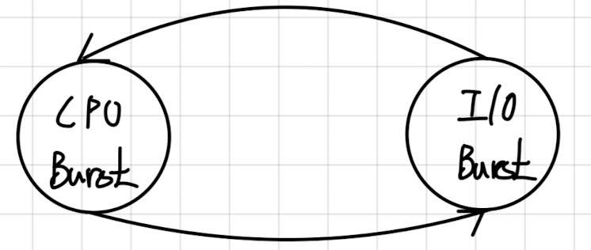
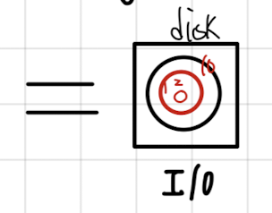
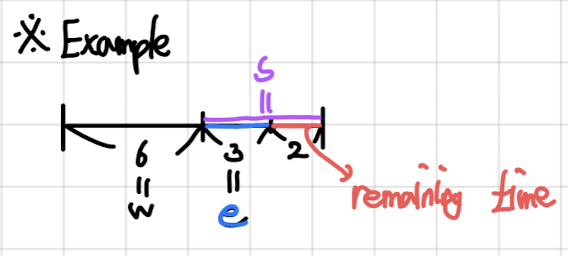

(이번 글은 운영체제의 기초가 있고 이번 주제에 처음 접하는 컴퓨터공학을 전공하는 학부생에 대해 적합한 글입니다.)

## 들어가면서

이번 글에서는 Uni-processor(CPU 1개)에 대한 Process Scheduling의 용어(Terminologies)와 여러 종류의 스케줄링(Scheduling)을 살펴볼 예정이다.

## 1. Terminologies

### (1) Process Scheduling

Process Scheduling은 OS의 진화 과정 속에서 multi-programming의 등장으로 system utilization을 높이기 위해 등장하게 되었다. memory의 공간적인 한계로 효율적인 multi-programming이 필요하였고 system 차원에서 여러 정책(policies)들이 요구되었다. 이러한 정책들을 성공시키기 위한 실행 전략으로 Scheduling Algorithm을 사용하게 되었다.

Process Scheduling은 Processor Scheduling 또는 CPU Scheduling라고 말하며 일반적으로 Process Scheduling라 부른다.

### (2) Burst (time)

Burst란 어떤 활동이 집중된 시간 또는 기간(구간)을 말한다. Burst는 크게 2가지로 나눌 수 있는데, CPU Burst와 I/O Burst가 있다.

CPU Burst는 CPU 자원을 집중적으로 활용하는 구간을 말한다. 반면, I/O Burst는 I/O operation이 집중하는데 걸리는 시간을 말한다. 예를 들면, load store, add store, read from file 등의 명령어 수행은 CPU Burst이고 wait for I/O는 I/O Burst라 볼 수 있다. 이렇듯 computer program의 특징으로 인하여 CPU Burst와 I/O Burst는 서로 번갈아가며 나올 수 밖에 없고 이러한 cycle을 CPU-I/O Burst Cycle라 한다.

<figure style="text-align: center;">
  
  <figcaption style="color:gray; text-align: center;">CPU-I/O Burst Cycle</figcaption>
</figure>

### (3) Types of processes or Program Behavior

process들의 속성(유형)을 말할 때 2가지의 **상대적인** 유형으로 구분할 수가 있다.

### 1) CPU (processor) bound

CPU bound는 CPU 중심 process라 한다. 즉, CPU를 **상대적으로** intensive(많이) 사용하는 program의 성격을 말한다.

### 2) I/O bound

I/O bound는 I/O 중심 process라 하며, I/O를 **상대적으로** intensive 사용하는 program의 성격을 말한다.

두 CPU bound와 I/O bound은 어떤 기준이 있어 분류되는 개념이 아닌 **상대적으로** 정의된 개념임을 주의하도록 하자.

> 보통 두 개념을 사용하는 문맥은 다음과 같다.   
> Example 1: 이 computer system의 workload(input의 type)에는 CPU bound process들이 많이 오니 FIFO 스케줄링이 적합한거 같아.  
> Example 2: computer system의 성능 향상을 위해서 CPU bound process와 I/O bound process들의 balance를 맞춰야 돼! (그 이유는 CPU bound process가 상대적으로 I/O bound process보다 많다면 CPU만 과하게 경쟁이 증가하기 때문이다.)

## 2. Types of Scheduling

### (1) Long-term scheduling (장기 스케줄링)

Long-term scheduling은 process가 처음 생성될 때 memory로 갈지 또는 CPU로 갈지를 결정하는 알고리즘을 말한다.

Long-term scheduling은 I/O bound process와 CPU bound process의 balance를 조절할 수 있어서 중요한 알고리즘이다.

### (2) Medium-term scheduling (중기 스케줄링)

Medium-term scheduling은 Long-term scheduling보다 빈번한 event로 메모리 부족 또는 메모리 여유가 있을 때 스케줄링 하는 알고리즘이다.

예를 들면, memory의 capacity를 가리키는 임계점이 80%라면, 80% 이상 쓰면 swapd라는 daemon이 cold data를 골라서 disk로 swap-out 시킨다. 만약, 60%로 여유가 있다면 disk에서 memory로 swap-in 시킨다.

이렇듯 Long-term scheduling 보다는 trigger 되는 event가 빈번한 특징이 있다.

### (3) Short-term scheduling (단기 스케줄링. Uni-processor의 Process Scheduling은 여기에 집중한다)

Short-term scheduling은 CPU에 의해 실행될 다음번 프로세스로 어떤 프로세스를 선택할지 결정하는 알고리즘을 말한다.

예를 들면, time slice(시간 할당량)을 다 사용할 때나 현재 process가 blocking이 되거나 선점되어 trigeer되는 event이다.

또한, 이 스케줄링은 ms 단위로 빈번한 event이다.

### (4) I/O scheduling

I/O scheduling은 대기 중인 입출력 요구 중 해당 입출력 장치가 다음번에 어떤 요구를 처리할지를 결정하는 알고리즘을 말한다.

예를 들면, 1번과 2번이 같은 트랙이면 disk의 arm이 움직이지 않고 바로 처리할 수가 있다. 만약, 1번, 10번, 2번 요청이 오면 1번과 2번을 같이 처리하고 10번을 처리하는게 효과적일 것이다.

<figure style="text-align: center;">
  
  <figcaption style="color:gray; text-align: center;">Example of I/O scheduling</figcaption>
</figure>

## 3. Scheduling Criteria

### (1) System Oriented (System 중심의 metrics)

### 1) Throughput

Throughput은 단위 시간에 처리된 process 수를 말한다.

예를 들면, 30분에 completion되는 process 수가 3개라면 1시간에는 6개를 처리하므로 Throughput은 6(개/시간)이 된다.

### 2) Processor Utilization

Process Utilization은 시간적 이용률을 말한다.

### 3) Fairness

Fairness는 process들이 evenly하게 service를 받는 것을 말한다.

> ※ Fair-share 란? (≠ Fairness)  
> 예를 들면, process 1과 process 2가 3:1 비율로 service를 제공해야하는 Cloud Server인 경우 3:1 비율로 제공해야 Fair할 것이다. 이를 Fair-share라 하며, 자본주의 성격의 metric이다.

### (2) User Oriented (User 중심의 metrics)

### 1) Turn-around time (반환 시간)

Turn-around time은 process가 submission 되고 completion이 될 때까지의 걸린 시간을 말한다.

예를 들면, idle한 Uni-processor에 어떤 process가 1시에 arrival(도착)하고 completion이 3시에 되었다면 Turn-around time은 'completion time - arrival time' 이므로 반환 시간은 2시간이 된다.

### 2) Response time (응답 시간)

Response time은 service가 제출되고 **첫 번째 응답**이 오기까지의 시간을 말한다.

예를 들면, 초 단위로 응답 시간을 가정하면 어떤 process가 0초에 도착하자마자 READY state라면(기다리게 되는) 상황에서 RUNNING state로 처음으로 10초에 바뀌었다면 이 process의 응답 시간은 6초가 된다.

보통 Response time은 I/O bound task가 많은 Personal Computer에 중요한 metric이며 이 상황에서는 추가로 Turn-around time도 중요한 지표로 사용되기도 한다(OS의 진화 과정 중 Time Sharing System의 등장 배경과 밀접한 관련이 있다).

### 3) Deadline (마감 시간)

Deadline은 Completion deadline(완료 마감 시간)과 Start dealine(시작 마감 시간)로 크게 2가지로 구분할 수 있다.

Completion deadline은 이 시간까지는 그 process가 완료(종료, termination)이 되어야 하는 시간이고, Start deadline은 적어도 이 시간 전엔 시작(start)되어야 하는 시간을 말한다.

보통 Deadline metric이 중요한 상황은 마감 시간이 중요한 Embedded system이나 Real-time(특정 condition이 중요한 상황)인 경우에 평가 지표로 사용되기도 한다.

## 4. Components of Scheduling Algorithm

### (1) Selection Function (선택 함수)

Selection Function은 어느 process를 다음 실행을 위해 선택할 지를 결정하는 Algorithm이다. Selection Function은 Scheduling Algorithm의 구성 요소 중 제일 중요한 요소이다.

> ※ Abbreviation-based scheduling notations  
> - w (waiting time): 지금까지 기다린 시간 또는 대기시간을 말한다.  
> - e (execution time): 지금까지 실행하는 데에만 걸린 시간을 말한다.  
> - s (service time, CPU burst time): process가 시작해서 종료하기까지 걸릴 총 서비스 시간을 말한다. service time은 'execution time + remaining time'이다.  
> - TAT (Turn-around time): 앞서 설명한 Turn-around time의 약어이다.

<figure style="text-align: center;">
  
  <figcaption style="color:gray; text-align: center;">Example of Abbreviation-based scheduling notations</figcaption>
</figure>

### (2) Decision Mode

Decision Mode는 selection function이 얼마나 자주 호출되는가를 결정한다. Decision Mode에는 Non-preemptive (비 선점모드)와 Preemptive (선점 모드)로 나뉜다.

### 1) Non-preemptive

Non-preemptive는 selection function이 선택되면 OS가 인위적으로 뺏지 않는 모드를 말한다. 즉, 현재 process가 termination이 될 때까지 다른 process에게 제어권(control)을 넘겨주지 않는다.

이러한 특징으로 Non-preemptive는 I/O operation을 하거나(즉, Blocked state로 가거나) 스스로 termination 하는 경우(즉, Linux OS 기준의 exit() 호출 시)에만 control을 넘겨줘서 Scheduling Function이 호출 된다.

### 2) Preemptive

Preemptive는 OS가 뺏을 수 있는 모드를 말한다.

보통 새로운 process가 creation(fork)되어서 Ready queue에 insert되어 우선순위가 나보다 높은게 등장할 때 preemtion(선점)하거나 time slice을 다 사용해서 time out 되거나 I/O completion event가 발생하는 상황에서 OS가 control을 뺏을 수 있다. 즉, Non-preemptive보다 process switch가 빈번하기 때문에 **process switch로 인한 overhead가 더 큰 문제**가 있다.

## 5. FIFO (First In, First Out)

### (1) Selection Function: max[w]

FIFO의 선택 함수는 max[w]로 waiting time이 가장 큰 process를 next process로 선택한다. 즉, Ready queue에 먼저 들어온 process를 먼저 선택하는 알고리즘이다.

max[w] 알고리즘은 **Constant Time**에 수행이 가능하다.

(그 이유는 시간의 흐름은 항상 증가하는 방향으로 가기 때문에 process는 순서대로 줄만 서면 되어서, 먼저 들어온 process를 확인하는데 상수시간에 수행할 수가 있다. 따라서, 탐색하는데 걸리는 시간은 O(n) time이 아닌 O(1) time임을 주의하자.)

### (2) Decision Mode: Non-preemptive

FIFO 알고리즘은 Non-preemptive이다. 즉, 현재 process는 수행을 마치기 전까지 OS가 control을 뺏을 수 없다.

### (3) Advantages와 Disadvantages

장점은 **구현이 단순하다.** 구현의 단순함으로 구현할 때 overhead가 크지 않게 된다.

단점으로는 FIFO는 **long process를 우대하는 전략**이다. 즉, shor process보다 long process가 많은 상황이라면 Non-preemptive로 인하여 **long-process가 완료되기 전까지 short process는 대기를 해야한다.**

또한, CPU bound process를 우대하는 경향이 있다. 만약 I/O bound process가 다수라면, CPU bound process가 Running하는 동안 계속 대기를 해야한다. 이는 모든 I/O devices를 idle하게 만드는 셈이 된다.

### (4) Convoy Effect

Convoy Effect는 short process가 long process에 막혀서 지연시간이 길어지는 것을 말한다.

## 6. Shortest Process Nest (SPN)

Shortest Process Nest는 Shortest Job First (SJF)라고도 불린다. SPN은 FIFO의 long process를 우대하는 문제점을 해결할 수 있을 것으로 기대된다(그렇게 예상을 하고 아래 글을 읽어보도록 하자).

### (1) Selection Function: min[s]

SPN의 선택 함수는 service time이 가장 적은 process를 선택한다. 즉, 가장 작은 service time을 가지는 process를 확인하려면 O(n) time이 걸릴 수 밖에 없다(물론, O(log n) time으로 구현할 수 있지만 보통은 O(n) time이 걸린다).

### (2) Decision Time: Non-preemptive

SPN도 Non-preemptive 모드를 사용한다.

### (3) Advantages와 Disadvantages

SPN은 크게 2가지 문제점이 있다.

첫 번째로, **service time의 예측 어려움**이다. service time 예측은 현대에서도 고민하는 문제이며 정확한 값에 예측이 어려워서 추정하는 방법을 사용한다.

두 번째로, **starvation(기아)의 발생 가능성**이다. 즉, short process가 계속(끊임없이) Ready queue에 insert 된다면 long process는 결국 선택되지 못하게 되는 문제가 있다.

SPN의 장점으로 Turn-around time 관점에서 성능 개선이 이루어진다는 점이다. FIFO의 문제인 Convoy Effect를 해결하여 short process가 long process의 가로 막혀 지연 시간 길어지는 문제를 해결한다.

> 그렇다면 SPN이 FIFO보다 항상 좋은가?  
> \: 그렇지 않다. Scheduling Metrics 중 Turn-around time이 SPN이 FIFO보다 개선될 수 있지만, 눈에 보이지 않는 overhead도 고려해볼 부분이다. FIFO의 최대 장점은 구현의 단순함인데 만약 SPN과 FIFO의 Turn-around time에서 차이가 많지 않다면 구현이 단순한 FIFO도 선택지가 될 수가 있다는 점이다. 이렇듯 우리는 Process Scheduling 할 때 눈에 보이지 않는 overhead도 고민하는 사고의 습관을 가져야만 한다.

> ※ 생각해보기: Tie-break 란?  
> \: 동점일 때 우열을 가르는 추가 기준을 말한다. 보통 OS에서는 동점이 나온 경우 process 선택의 추가 기준으로 PID가 낮은 것을 우대한다(PID가 큰 것을 선택해도 크게 성능에 영향을 미치지 않는다). 즉, 보통은 FIFO 방식으로 선택하고 그럼에도 성능에 미치는 영향은 크게 없다.

## 7. Shortest Remaining Time (SRT)

### (1) Selection Function: min[s-e]

여기서 s-e는 service time에서 execution time을 뺀 값으로 remaining time을 말한다. 즉, SRT의 선택 함수는 다음 process 선택의 기준으로 남아 있는 시간을 기준으로 비교하여 SPN 방식 보다는 비교하는게 대등하다고 볼 수 있다.

### (2) Decision Mode: preemption

SRT는 FIFO와 SPN과 다르게 선점 모드를 사용한다. 즉, remaining time이 작은 process가 등장하게 되면 현재 process가 completion 되기 전에 제어권을 다른 process에 넘겨주어 선점할 수 있게 된다.

### (3) Advantages와 Disadvantages

SPN에 비해 SRT는 Turn-around time에서 월등한 성능을 보인다(그 이유로 short process에게 우선권을 주기 때문이다).

또한, 각 process의 service time 중 지금까지 얼마나 서비스를 받았는지를 기억해야 되는 overhead가 존재한다(이러한 overhead를 고민하는 사고의 연습을 반복하자).

하지만, SRT는 SPN의 2가지 문제를 해결하지 못 하였다. 즉, service time의 예측 어려움과 starvation 문제가 여전히 존재한다.

## 8. Highest Response Ratio Next (HRRN)

### (1) Selection Function: max[(w+s)/s)]

HRRN의 선택 함수는 max[(w+s)/s]로 반응 비율이 가장 큰 process를 선택한다.

여기서 반응 비율(R=(w+s)/s)이란 어떤 process의 정규화된 나이를 말한다. 만약, w/s에 대하여 s(service time)가 작을 수록 반응 비율은 커지게 되므로 short process를 우대하게 된다. 또는 s가 길더라도 s는 상수이므로 변수인 w(waiting time)가 클 수록 해당 process는 전반적으로 선택될 확률이 높아질 것이다. 이러한 철학이 담긴 HRRN은 **starvation 문제를 완전히 해결하였다**(그 이유는 기존의 starvation 문제가 발생하는 스케줄링 알고리즘들은 공통적으로 service time만 고려해서 그렇다. HRRN은 service time과 waiting time까지 모두 고려하여 long process도 경쟁할 만한 상황을 만들어 주었다).

### (2) Decision Mode: Non-preemptive

HRRN은 비 선점 모드이다.

### (3) Advantages와 Disadvantages

장점으로 waiting time을 고려한 알고리즘으로 인하여 starvation 문제를 완전히 해결하였다.

단점으로 여전히 service time의 예측 어려움을 해결하지는 못 하였다.

이 HRRN 알고리즘은 Turn-around time metric에서는 단순히 waiting time의 최댓값이 다음 process를 결정하는 FIFO 알고리즘보다는 좋을 것이고, service time만 고려하는 SPN 알고리즘 보다는 좋지 않을 것이다(라고 예상 할 수 있어야 하고, 실제로 그러하다).

## 9. Round-Robin

Round-Robin의 동작 원리는 FIFO와 같다.

또한, Round-Robin의 구현은 FIFO + timer로, time slice 만큼 순회하는 단순한 알고리즘이다.

### (1) Selection Function: constant

Round-Robin의 선택 함수는 Constant time으로 i++; 로 구현된다.

### (2) Decision Mode: preemptive

Round-Robin은 대표적인 preemptive 알고리즘이다.

### (3) Advantages와 Disadvantages

Round-Robin은 장점과 단점에 집중하기 보다는 Round-Robin의 철학을 이해하는게 중요하다. Round-Robin의 철학에 대해 살펴보도록 하자.

### (4) Round-Robin 철학과 진리

### 1) (철학) Round-Robin의 주요한 system인자는 time slice의 크기이다.

time slice의 크기가 극단적으로 무한대로 커지는 상황을 상상해보자. 그렇다면 이 알고리즘은 FIFO와 동일해질 것이다. 그 이유는 비선점 모드인 FIFO 알고리즘은 long process를 우대하는 문제가 있는데 time slice의 크기가 크다면 해당 long process가 completion 되기 전까지는 short process는 wait하는 상황이 발생하게 될 것이다.

이번엔 time slice의 크기가 극단적으로 0에 수렴하는 상황을 상상해보자. 그러면 이 알고리즘은 SPN 전략과 비슷해질 것이다(독자는 이와 같은 상상을 생각하고 예상할 수 있어야 한다). 그 이유는 FIFO의 convoy effect 문제를 SPN 알고리즘에서는 min[s]로 long process에 막혀 short process의 지연시간 문제를 해결하는데 이는 short process를 우대하는 상황이 발생될 것이다.

이와 같은 상황을 환경에 따라 전략을 달리 하는 알고리즘이 Round-Robin이다. 즉, Round-Robin은 **adapted scheduler**라 부르며 general algorithm이라고도 한다. 이러한 철학이 내제되어 있다.

### 2) (진리) time slice를 줄이면 줄일 수록 response time은 줄어든다.

Round-Robin은 이 진리를 위해 만들어진 알고리즘이다. 즉, response time은 Round-Robin의 중요한 metric 중 하나이다.

또한, **time slice를 줄이면 줄일 수록 TAT(Turn-around time)는 항상 줄어들진 않는다.**

### 3) (기타 - 장점) system utilization을 높여준다.

대게의 경우 time slice를 줄이면 CPU와 I/O Device 간의 overlap 되는 구간이 많아지게 되므로 system utilization을 높힐 수 있다.

### 4) (기타 - 단점, 문제점) 여전히 long process가 유리한 게임의 룰이다.

Silberschatz의 운영체제 책에서 CPU burst의 distribution 분포를 보면 short CPU burst의 분포가 long CPU burst에 비해 상대적으로 많다는 것을 알 수 있다. 여기서 대부분의 short process들은 time slice를 모두 소진하지 못 하는 반면, long process들은 time slice를 모두 소진한다(상대적으로 이 기준에선 소진하는 경향이 있다). 이러한 기준에서는 Round-Robin도 long process가 여전히 유리한 게임의 룰이다.

이러한 balance를 맞추는 방법에는 2가지 전략이 있다. 첫 번째는 long process에게 패널티를 부여하는 것이고 두 번째는 short process를 우대하는 방법이 있다.

## 10. Virtual Round Robin (VRR)

VRR은 이러한 불균형 문제를 보조큐(Auxiliary queue)를 두어 short process에게 우선권을 주는 전략을 사용한다.

예를 들면, I/O bound process라면 정해진 time slice를 다 사용하지 못 한채로 Blocked 될 것이다. 이러한 process를 대상으로 I/O completion이 오면 기존의 Ready queue가 아닌 short process에게 우선권을 주는 Auxiliary queue에 insert하여 time slice를 완화시킬 수 있다. 다시 말해 fairness를 높이는 전략이다.

우리는 여기서 insight를 얻을 수 있는데, 만약 **time slice를 다 소진하지 못 한 process라면 I/O bound**이고 **time slice를 소진한 process는 CPU bound**라는 것을 알 수 있다.

## 11. Multi-Level Feedback Queues (UP의 끝판왕)

VRR 알고리즘만으로 workload가 시간에 따라 분산이 변하는 상황을 대처하기에는 한계가 있다. Run-time에 시간에 흐름에 따라서 workload들이 바뀔 수 있는데 여러 개의 time slice의 queue를 두어서 Dynamic하게 스케줄링 하는 알고리즘을 Multi-Level Feedback Queues라 한다.

즉, Simple Round-Robin은 time slice가 하나인 static인 반면에 Multi-Level Feedback Queues는 여러 큐를 두어서 동적으로 선택하여 사용하는 알고리즘이다.

예를 들면, time slice를 다 소진하지 못 한 process라면 short process이므로 다시 동일한 queue로 insert 되지만, time slice를 다 소진한 process라면 long process이므로 next queue로 강등시켜 패널티를 부여한다(next queue는 previous queue의 time slice의 2배인 시간 할당량을 가진다. 이러한 기법을 Double up라 한다).

하지만 이러한 방식은 short process를 우대하게 되어 starvation 문제가 발생할 수 있는데 이 알고리즘은 적절하게 승급(promotion)시켜 balance를 조절하는 특징이 있다.

Multi-Level Feedback Queues는 전공 교재마다, 사람마다 구현을 다르게 하므로 이 알고리즘의 등장 배경과 철학 정도만 이해하고 넘어가도록 하자.

## 참고문헌

(글 작성할 때 최대한 주관적인 부분은 제외하려고 하였습니다. 대부분 내용은 대학교 강의 내용 기반으로 작성되었습니다.)

- 대학교 오퍼레이팅 시스템 강의
- 운영체제 - 내부구조 및 설계원리, 제8판 (William Stallings)